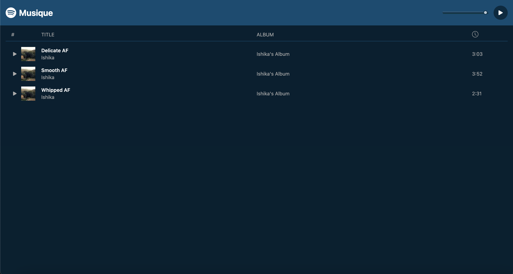

# Musique

### Musique is a stylish music application powered by Next.js, React, Tailwind CSS, and Howler for seamless audio playback.

### Delve into a world of melodies with an intuitive interface, customizable styling using Tailwind CSS, and captivating images sourced from Unsplash.

## Image:

## Video:

https://github.com/ishii26/Music_app/assets/123073853/efba7be6-2502-4b7d-bdb9-b7fb18a7c1fb

## Features:

#### Next.js Power:

###### Leveraged Next.js for efficient server-side rendering and routing.

#### React Components:

###### Utilized React for dynamic and responsive UI elements.

#### Tailwind CSS Styling:

###### Customizable styling with Tailwind CSS for a unique look and feel.

#### Howler Integration:

###### Used smooth audio playback with Howler library.

#### Unsplash Images:

###### Enhanced the visual appeal with stunning images sourced from Unsplash.

### Experience the harmony of music and design with Musique! 🎶🎧
